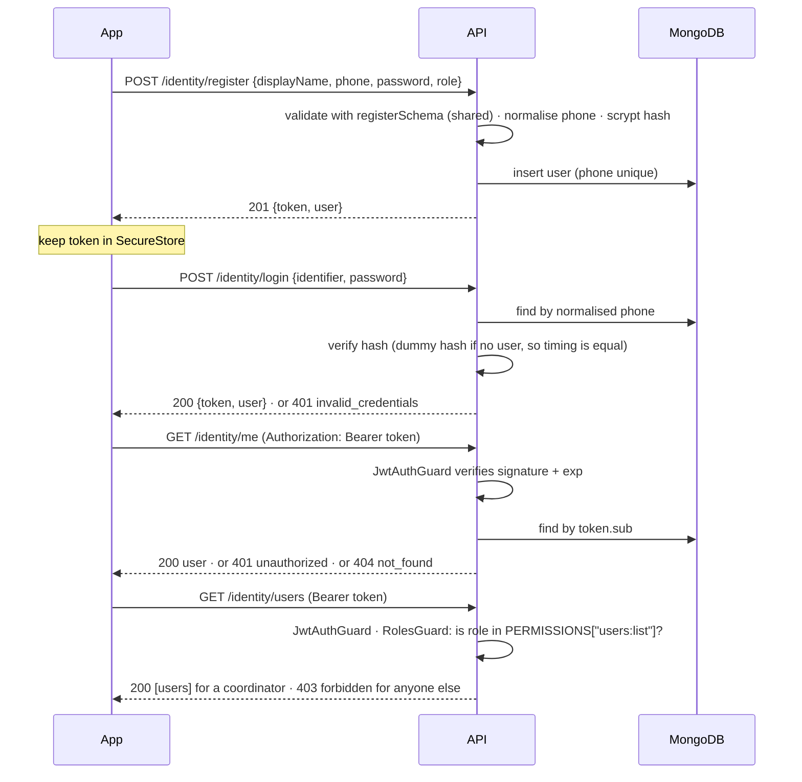

# Authentication and roles

How a person gets an account, proves it is them, and what their role lets them do. Written for
whoever builds the next screen or endpoint on top of it — including the developer owning each of
the four roles' onboarding.

Decided 18 September 2026. The reasoning for the choices is in `DECISIONS.md`; this file is the
*how it works*.

Also in this folder: `PLAN.md` (the gated plan that built this, and where the result differs from
it) and `OPEN.md` (what is still to be decided, most urgent first).

## The short version

- **Credential:** phone number + password. No OTP, no SMS, no email verification yet. Email is
  reserved as a second credential (the column exists) but is not accepted anywhere today.
- **All four roles self-register:** farmer, buyer, coordinator, logistics. The sign-up flow shows
  four paths. Vetting an account is what the `status` field is for, not the register endpoint.
- **Session:** one signed access token (a JWT), valid 30 days, kept on the device. No refresh
  token. Logging out deletes the token from the device.
- **Access control:** a role is baked into the token; a permission matrix in `packages/shared`
  says which roles may do which action; the api enforces it per endpoint and the app reads the
  same table to decide what to show.

## Vocabulary

| Term | Meaning here |
| ---- | ------------ |
| **Hash** | A one-way scramble of the password. The api stores only the hash; it can check a password against it but cannot get the password back. Algorithm: scrypt (built into Node, no native build). |
| **JWT** (JSON Web Token) | A small signed string the api hands out on login. It carries `sub` (the user id), `role`, `iat` (issued at) and `exp` (expires). Signed with `JWT_SECRET` using HS256, so the api can trust its contents without a database lookup. |
| **Bearer token** | How the app sends the JWT: the header `Authorization: Bearer <token>` on every request that needs a signed-in user. |
| **Guard** | NestJS's word for "a check that runs before the handler". Two exist: is there a valid token, and is this role allowed here. |
| **401 vs 403** | 401 `unauthorized` means "no valid session — sign in again". 403 `forbidden` means "you are signed in, but this is not for your role". The app must treat them differently: a 401 clears the session, a 403 shows a message. |

## The flow



## Endpoints

| Method | Path | Token | Body | Success | Refusals |
| ------ | ---- | ----- | ---- | ------- | -------- |
| POST | `/identity/register` | no | `registerSchema` | 201 `authResponse` | 400 `validation_error`, 409 `phone_taken` |
| POST | `/identity/login` | no | `loginSchema` | 200 `authResponse` | 400 `validation_error`, 401 `invalid_credentials` |
| GET | `/identity/me` | yes | — | 200 `publicUser` | 401 `unauthorized`, 404 `not_found` |
| GET | `/identity/users` | yes, `users:list` | — | 200 `publicUser[]` | 401 `unauthorized`, 403 `forbidden` |
| GET | `/` | no | — | 200 health | |

Every refusal has the same body, `{ code, message }` (`apiErrorSchema` in shared).
`validation_error` adds `issues: [{ path, message }]` where `path` is the field name and `message`
is the sentence written in the shared schema, so the app can show it under the right input.

Phone numbers are accepted in any local spelling (`077 123 4567`, `0771234567`, `+94 77 123 4567`)
and stored as `+94XXXXXXXXX`. One account per number.

## The token

```
{ "sub": "<user id>", "role": "farmer", "iat": 1789000000, "exp": 1791592000 }
```

HS256, secret from `JWT_SECRET` (at least 32 characters; `env.ts` refuses to start otherwise),
lifetime from `JWT_EXPIRES_IN` (default `30d`). The api pins the algorithm on verification, so a
token claiming another algorithm is rejected, and then checks the claims against
`jwtPayloadSchema` so a guard never sees an unexpected shape.

**Trade-off, accepted:** there is no server-side session, so the api cannot revoke a token. A
stolen token works until `exp`; a role or status change is not seen until the person logs in
again. Two upgrade paths when that stops being acceptable, both behind the `TokenSigner` port:

1. **Short access token + refresh token** stored in the database — revocation by deleting the
   refresh token; the app silently refreshes.
2. **`tokenVersion` on the user** — the guard compares the token's version with the stored one;
   bumping the version logs every device out. Cheaper; costs one lookup per request.

`GET /identity/me` on every cold start narrows the gap in practice: a deleted account gets a 404,
and the app clears the session.

## Roles and permissions

The matrix lives in `packages/shared/src/identity/permissions.ts` and is the only place a role
name should appear in an access rule:

| Action | farmer | buyer | coordinator | logistics |
| ------ | :----: | :---: | :---------: | :-------: |
| `profile:read-self` | ✓ | ✓ | ✓ | ✓ |
| `listing:read` | ✓ | ✓ | ✓ | ✓ |
| `listing:create` | ✓ | | | |
| `order:place` | | ✓ | | |
| `order:accept` | ✓ | | | |
| `delivery:accept` | | | | ✓ |
| `users:list` | | | ✓ | |
| `farmers:approve` | | | ✓ | |

**api:** `@Allow('listing:create')` on a handler restricts it to the roles in that row.
`@Roles('farmer', 'coordinator')` exists for a rule that is not an action yet; prefer adding the
action. No decorator means any signed-in user; `@Public()` means no token at all.

**app:** `can(user.role, 'listing:create')` decides whether the button exists. Same table, so the
two cannot disagree.

Adding an action is one line in the matrix, then decorators and `can()` calls where it applies.

### Account status is stored, not enforced

`users.status` is `active` on registration; `pending_review` and `suspended` exist in the enum.
**No guard checks it yet.** The coordinator-approval gate for new farmers (`PRODUCT.md`) will set
`pending_review` on registration for that role and add a status check to `RolesGuard` — a
follow-up story, not part of FARM-34. When it lands, remember the role-in-token trade-off above: a
status change will not be seen until re-login unless one of the upgrade paths is taken.

## Where the code is

```
packages/shared/src/identity/       schemas both sides use: role, phone, register/login,
                                    publicUser, authResponse, apiError, jwtPayload, PERMISSIONS
api/src/identity/
  domain/                           User entity, UserRepository interface
  application/
    ports/                          PasswordHasher, TokenSigner (interfaces)
    services/                       RegisterUser, LoginUser, GetMe, ListUsers
    errors.ts                       IdentityError codes
  infrastructure/
    persistence/                    Mongoose schema + repository, in-memory repository
    security/                       ScryptPasswordHasher, JsonwebtokenTokenSigner
  auth/                             JwtAuthGuard, RolesGuard, @Public, @Allow/@Roles, @CurrentUser
  identity.controller.ts            the four routes
  identity-error.filter.ts          code → HTTP status
  identity.module.ts                wiring; guards registered globally
api/src/shared/http/                ZodValidationPipe
api/src/config/env.ts               JWT_SECRET, JWT_EXPIRES_IN validation
```

## Why the core has no NestJS in it

`domain/` and `application/` import nothing from `@nestjs/*` or `mongoose` — ESLint fails the
build if they do. The use-cases are plain classes that take their three dependencies in the
constructor. Nest builds them in `identity.module.ts` with `useFactory`; anything else can build
them with `new`.

That is what makes the "runs under NestJS or Expo API routes" requirement true rather than hoped
for. An Expo API route (`app/identity/register+api.ts`) would be:

```ts
import { registerSchema } from '@farm-pool/shared';
import { RegisterUser } from '<api>/identity/application/services/register-user';
import { IdentityError } from '<api>/identity/application/errors';
// + the same three adapters from infrastructure/

const registerUser = new RegisterUser(userRepository, passwordHasher, tokenSigner);

export async function POST(request: Request) {
  const parsed = registerSchema.safeParse(await request.json());
  if (!parsed.success) return Response.json({ code: 'validation_error', ... }, { status: 400 });
  try {
    return Response.json(await registerUser.execute(parsed.data), { status: 201 });
  } catch (e) {
    if (e instanceof IdentityError && e.code === 'phone_taken')
      return Response.json({ code: e.code, message: e.message }, { status: 409 });
    throw e;
  }
}
```

The `try/catch` is what `IdentityErrorFilter` does for Nest; the `safeParse` is what
`ZodValidationPipe` does. Nothing in the use-case changes.

The core stays inside `api/` rather than in a `packages/auth` because it has one consumer.
`STRUCTURE.md`'s rule: a shared package with one consumer is indirection for its own sake. Extract
it when a second runtime actually imports it, and extract from real usage.

## How to add email as a credential

Everything is already in place except the branch:

1. `registerSchema` gains an optional `email` (`z.email()`), and `RegisterUser` passes it through
   — the Mongoose schema already stores it lowercase with a sparse unique index.
2. `LoginUser.execute`: where `normalizeSriLankanPhone` returns `null`, try
   `users.findByEmail(identifier)` before giving up.
3. `IdentityErrorCode` gains `email_taken`; the Mongoose repository already distinguishes the
   duplicate key, so map it there.
4. The login form's label changes from "Phone number" to "Phone or email".

No migration, no request-shape change: `identifier` was named that for this reason.

## What is deliberately not here

- **OTP / SMS verification.** Needs a paid SMS gateway and a Sri Lankan sender id; out of scope
  for the module. The phone is trusted as typed.
- **Password reset.** Depends on the above (or on email). Until then a coordinator resets by hand.
- **Rate limiting on login.** Add `@nestjs/throttler` on the two public routes before any public
  deployment; the dummy-hash timing equalisation is not a substitute.
- **Refresh tokens / revocation.** See "The token".
